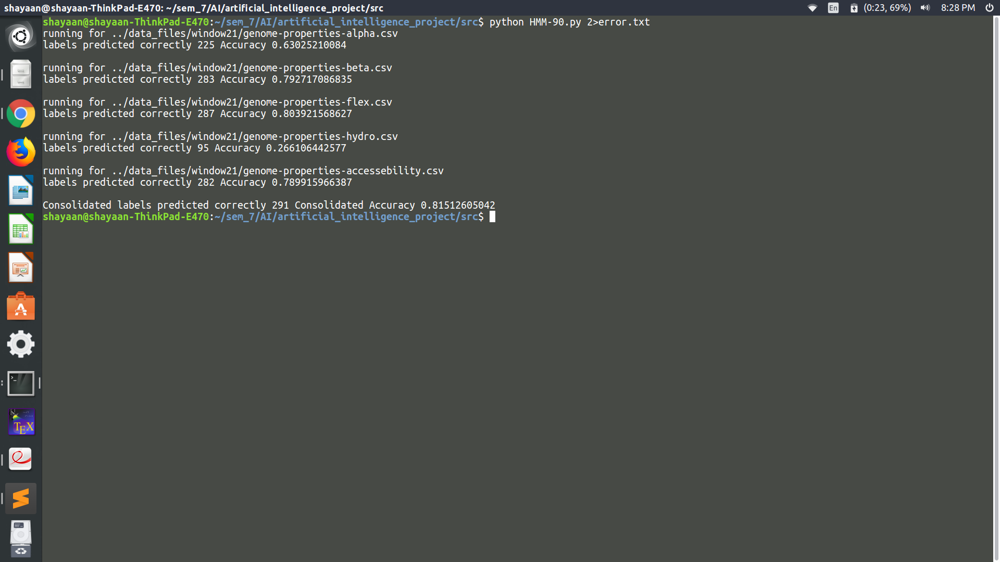

# Antigen Prediction in *Plasmodium Falciparum*
This file contains the instructions to compile and execute the models, that are used to predict whether a genome sequence of *Plasmodium Flaciparum* is antigenic or not.

## Dependencies

The required dependencies to use the train and use the model.

* Python (>= 2.6)
* Numpy (>= 1.9.3)
* scikit-learn (>= 0.16)
* SciPy ( >=0.16.0)
* hmmlearn (>=0.2.1)

## Installation of Dependencies
Type the following commands in the terminal to install the reuqired dependencies.
```bash
sudo apt-get install python-pip 
sudo pip install numpy scipy
sudo pip install scikit-learn
sudo pip install hmmlearn
```
## Directory Structure of The Project

The directory structure of the project is as follows.

````
Project
├── src
│   ├── subplot.py
│   ├── results
│   ├── plot.py
│   ├── Hidden_Marov_Models
│   │   ├── HMM.py
│   │   ├── HMM-ensemble.py
│   │   └── HMM-90.py
│   ├── HCRF2.0b
│   └── Data-Making-Code
│       ├── tfa_retention.py
│       ├── recognition_factor.py
│       ├── ratio_hetro.py
│       ├── polarity.py
│       ├── make_data.py
│       ├── hydrophobicity.py
│       ├── hmm_make_data.py
│       ├── flexibility.py
│       ├── features.py
│       ├── betaturn.py
│       ├── alphahelix.py
│       └── accessebility.py
├── result_images
├── report
│   └── report.pdf
├── README.md
└── data_files
    ├── window9
    ├── window5
    ├── window21
    ├── window19
    ├── window17
    ├── window13
    ├── window11
    ├── Ensemble-Data-Files
    └── antiname.txt
````
1. **Src** - This direcotory contains all the source code for the project.
	- The directory Data-Making-Code contains python scripts to synthesize data using the numeric values of the properties. In this directory **hmm_make_data.py**  is the scripts that is used to synthesize the data. This scripts calls the individual property functions, these functions allow the user to select different window sizes.
	- The directory Hidden_Markov_Model contains the scripts that are used to train and test the diffrent Markov Models.
	- The directory HCRF2.0b contains the source code for the HCRF model.
	
2. **result_images** - This directory contains the images of the confusion matrices.

3. **report** - This direcotry contains a pdf that breifly describes the project.

4. **data_files** - This directory contains all the data files that hve been used to train the various modles used.

## Running the scripts.

### Hidden Markov Modles

The Hidden Markov models are stored in a sub-directory in the **src** directory. There are three different types of HMM that were trained they are.

1. **HMM Averaging Ensemble** - This method involves training a model for each property of the proteome sequence and then combine the decisions of these models to make predictions. Then we decode the observed sequence to get the most likely state sequence. We make predictions based on this state sequence. If the hidden state sequence consisted of more epitopic regions than non-epitopic regions, thegenome sequence was labeled as antigenic and vice-versa.

2. **HMM Log Likelihood** - In this method, we capture all the properties in a single HMM model. The HMM is trained to model the probability distribution of
the non-antigenic sequences.

3. **HMM Log Likelihood Ensemble** - During training, a separate HMM model is trained for each property. An ensemble of these models created and the predicted class is the majority of the decisions of the models in the ensemble. For each model in the ensemble, the training and the inference procedure is similar to the previous experiment.

To run the script type the followng command

``` bash
python "Model name"
```



Here model name is one of the model stored in the sub-directory. The data-files that are used to train the model are present in a list format in the script.

```py
filename =["../../data_files/window9/genome-properties-alpha.csv","../../data_files/window9/genome-properties-beta.csv","../../data_files/window9/genome-properties-flex.csv","../../data_files/window9/genome-properties-hydro.csv","../../data_files/window9/genome-properties-accessebility.csv"]

```

The user can change the relative path to the data files to train the model using different data points.

<span style="color:red"> WARNING: All data files must have the same window size. </span>

After the model has run, it stores the actual labels as well as the predicted labels. These stored results can be visualized as confusion matrices, using the **plot.py** script present in the **src** directory


 
